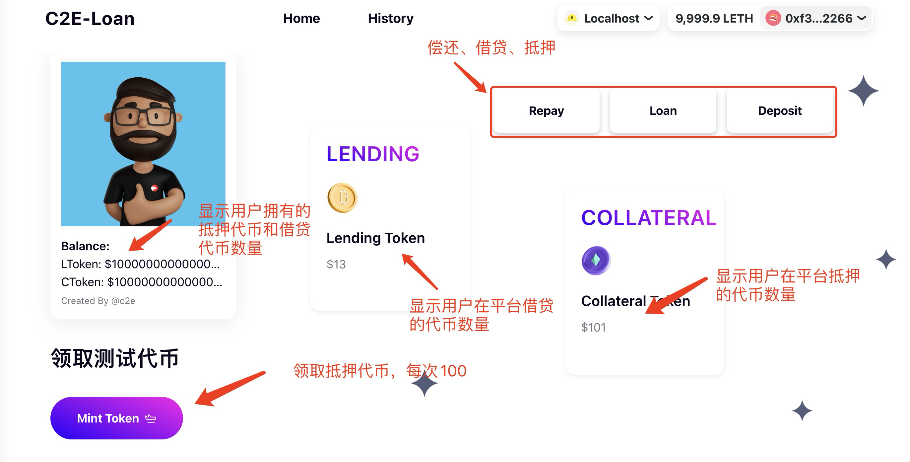

# 借贷合约

该合约实现了一个简单的去中心化借贷系统，用户可以存入抵押物代币，并根据抵押物借出另一种借贷代币（lending token）。此外，还提供了一个水龙头（faucet）功能，允许用户铸造抵押物代币用于测试。

## 功能

1. **存入抵押物**：用户可以存入一定数量的抵押物代币来作为借款的担保。
2. **借款**：用户可以根据抵押物借出借贷代币，要求用户存入的抵押物必须是借款金额的 150%。
3. **还款**：用户可以偿还所借的代币，偿还后债务减少。
4. **水龙头功能**：允许用户铸造一定数量的抵押物代币，用于测试。

## 合约部署

### 步骤 1：克隆项目并安装依赖

首先进入项目根目录并安装依赖。

```bash
cd lending-contract
npm install
```

### 步骤 2：编译合约

编译合约文件，确保一切正常。

```bash
npx hardhat compile
```

### 步骤 3：部署合约

该教程使用本地hardhat node作为测试网络进行部署，部署合约之前我们需要启动一个本地的 hardhat node。

```bash
npx hardhat node
```
运行之后不要关闭，我们编写一个部署脚本，重新启动一个新的命令行终端，使用 Hardhat 将合约部署到本地:

```bash
npx hardhat run scripts/deploy.js --network localhost
```

部署好之后可以在 运行npx hardhat node 的终端界面查看交易记录,之后就可以使用页面对我们的合约进行交互了

## 详细流程

### 1. 用户存入抵押物

用户首先调用 `depositCollateral` 函数，将抵押物代币（`collateralToken`）存入合约，并增加其在合约中的抵押余额。

### 2. 用户借款

用户在存入抵押物后，可以调用 `borrow` 函数借款。合约要求用户存入的抵押物金额必须是借款金额的 150%，否则会报错。借款成功后，借贷代币（`lendingToken`）会转到用户的账户中，同时记录用户的债务。

### 3. 用户还款

用户可以通过调用 `repay` 函数归还借贷的代币，并减少其债务。用户需要先批准合约使用其借贷代币。

### 4. 水龙头功能

用户可以使用水龙头功能，直接铸造一定数量的抵押物代币，用于测试。每次调用水龙头都会给用户铸造 100 个抵押物代币。

## 注意事项

- 合约设计为 150% 过度抵押，确保借贷系统的稳定性。
- 用户需要先批准合约使用其代币才能完成抵押、还款等操作。
- 合约中水龙头功能仅用于测试，不应用于生产环境。

### 合约中的事件

1. `CollateralDeposited`：当用户存入抵押物时触发。
2. `Borrowed`：当用户成功借款时触发。
3. `Repaid`：当用户还款时触发。
4. `FaucetUsed`：当用户调用水龙头领取抵押物代币时触发。

# 前端

## 前台交互说明

- **领取平台【抵押代币(CTK)】**
- **在平台抵押【抵押代币(CTK)】**
- **借出平台【借贷代币(LTK)】**
- **返还【借贷代币(LTK)】**

点击质押的Card可以添加对应Token到钱包



## 环境搭建

### 步骤 1：安装前端依赖

进入前端目录并安装依赖

```bash
cd loan-fe
npm install
```

### 步骤 2：启动项目（本地）

1. 启动前需要先**部署合约**，部署完成后将部署的
【借贷代币地址】、【抵押代币地址】、【借贷合约地址】添加到前台环境变量中

2. 前端环境变量配置:`./loan-fe/.env.local`中配置合约环境变量，内容如下

```shell
# LENDING CONTRACT ADDRESS
NEXT_PUBLIC_LENDING = 0x9fe46736679d2d9a65f0992f2272de9f3c7fa6e0

# //WALLET CONNECT 
NEXT_PUBLIC_WALLET_CONNECT = 4acb2b2a6471177270135fc95286e645

# 用于借贷的token(lending token)
NEXT_PUBLIC_LENDING_TOKEN = 0xe7f1725e7734ce288f8367e1bb143e90bb3f0512

# 用于抵押的token(collateral token)
NEXT_PUBLIC_COLLATERAL_TOKEN = 0x5FbDB2315678afecb367f032d93F642f64180aa3
```


【wallet connect】环境变量是项目需要使用wallect connect时注册的项目地址（支持移动端钱包）

使用wallet connect需要一个`projectId`，可以使用本项目提供的projectId，或者到以下网站[reown](https://cloud.reown.com/)，注册项目后获取projectId


3. 启动前台
`npm run dev`


### 选做步骤*： 前端部署到生产环境（使用vercel发布）

参考vercel文档
https://vercel.com/

### History页面*：借贷历史记录

history页面显示抵押和借贷历史记录，提供一个实践方向，同学可以补充完成这块业务
